# 🏏 IPL Data Analysis Dashboard

> An end-to-end Exploratory Data Analysis (EDA) project on the Indian Premier League (IPL) dataset using Python, Pandas, Matplotlib, and Plotly. This project analyzes historical IPL matches to uncover trends, team performances, venue statistics, toss decisions, and player achievements through informative visualizations.


---

# 📌 Project Overview

The Indian Premier League (IPL) is one of the world's most popular T20 cricket leagues. This project performs Exploratory Data Analysis (EDA) on IPL historical match data to discover meaningful insights about:

- 📅 Season-wise match trends
- 🏆 Team performance
- 🎯 Toss impact on match results
- 🏟️ Venue statistics
- ⭐ Player of the Match awards
- 📈 Winning margins
- 🔥 Head-to-head analysis

The project demonstrates practical data analysis skills using Python and visualization libraries.

---

# 📂 Repository Structure

```
IPL-Data-Analysis-Dashboard/
│
├── IPL.ipynb
├── ipl-matches.csv
├── README.md
│
├── 01_missing_values.png
├── 02_matches_per_season.png
├── 03_team_wins.png
├── 04_toss_analysis.png
├── 05_win_type.png
├── 06_venue_analysis.png
├── 07_potm.png
├── 08_team_over_years.png
├── 09_avg_margin.png
├── 10_day_distribution.png
└── 11_h2h_heatmap.png
```

---

# 🛠️ Technologies Used

- Python
- Pandas
- NumPy
- Matplotlib
- Plotly
- Jupyter Notebook

---

# 📊 Analysis Performed

✔ Data Cleaning

✔ Missing Value Analysis

✔ Matches Per Season

✔ Team Wins Analysis

✔ Toss Analysis

✔ Winning Type Analysis

✔ Venue Analysis

✔ Player of the Match Analysis

✔ Team Performance Across Seasons

✔ Average Winning Margin

✔ Day vs Night Match Distribution

✔ Head-to-Head Heatmap

---

# 📷 Dashboard Visualizations

## Missing Value Analysis

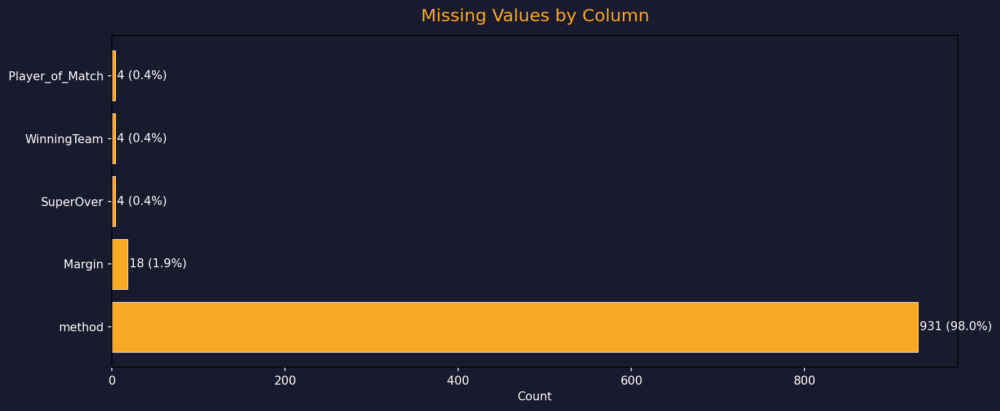

---

## Matches Played Per Season

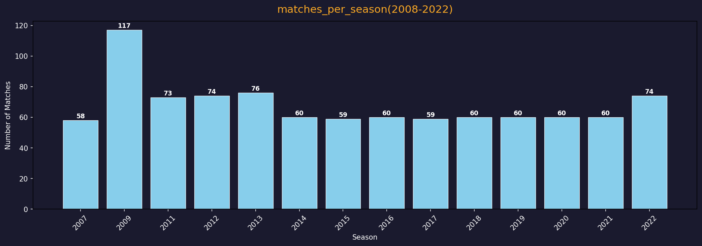

---

## Team Wins

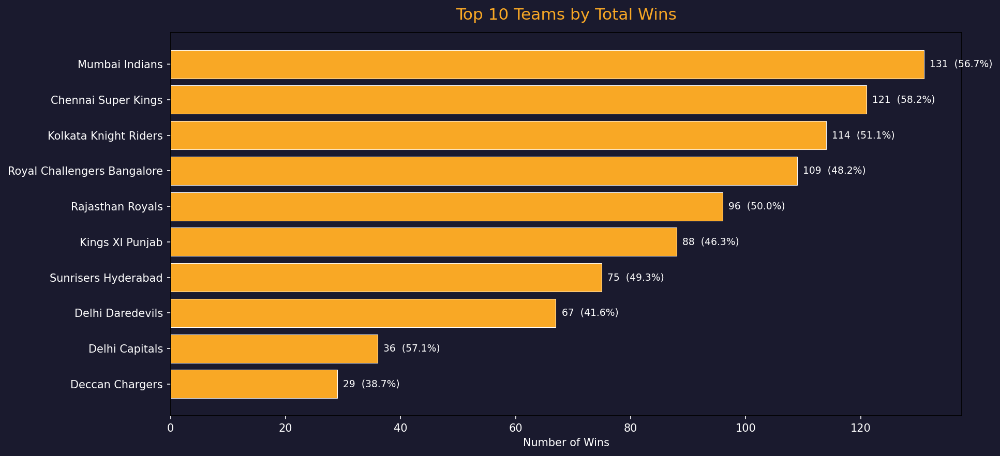

---

## Toss Analysis

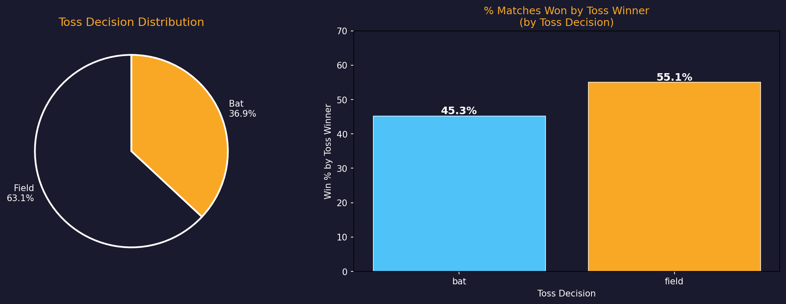

---

## Win Type Analysis

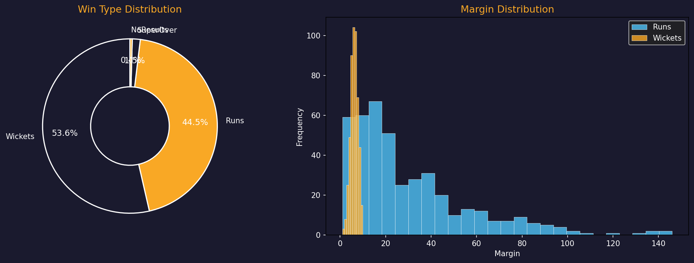

---

## Venue Analysis

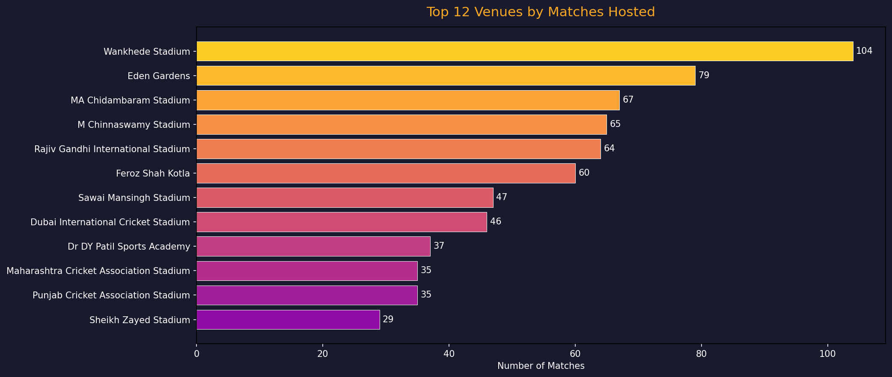

---

## Player of the Match Awards

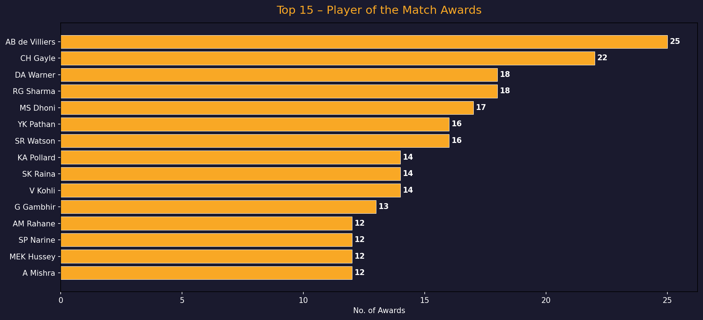

---

## Team Performance Over Years

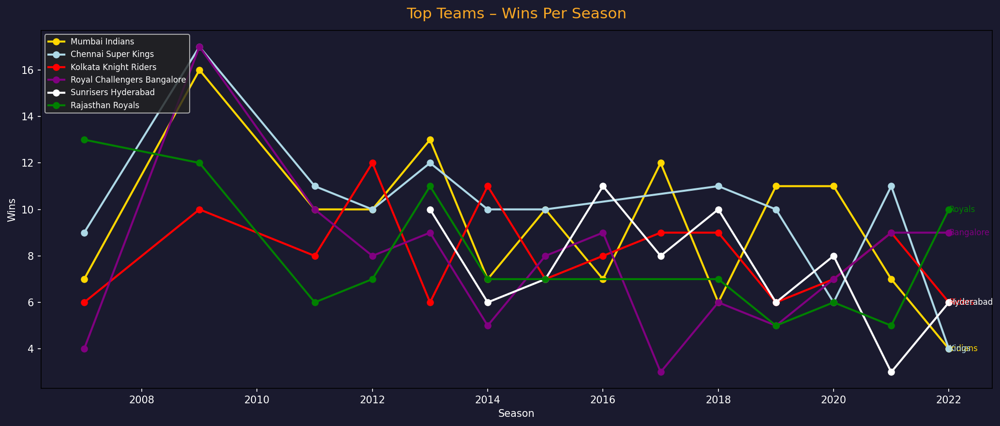

---

## Average Winning Margin

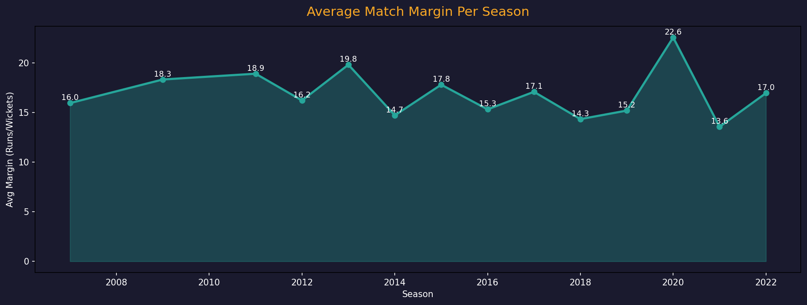

---

## Day vs Night Match Distribution

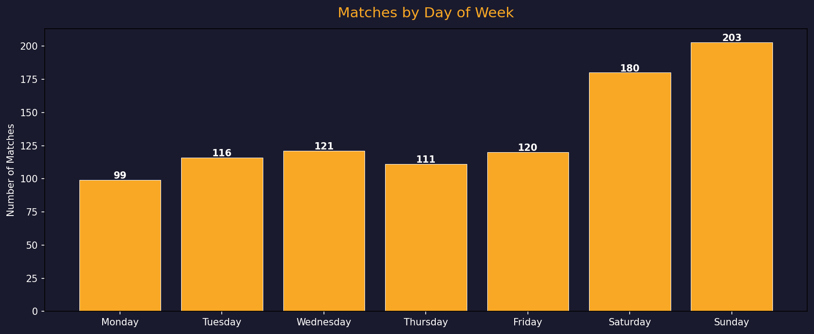

---

## Head-to-Head Heatmap

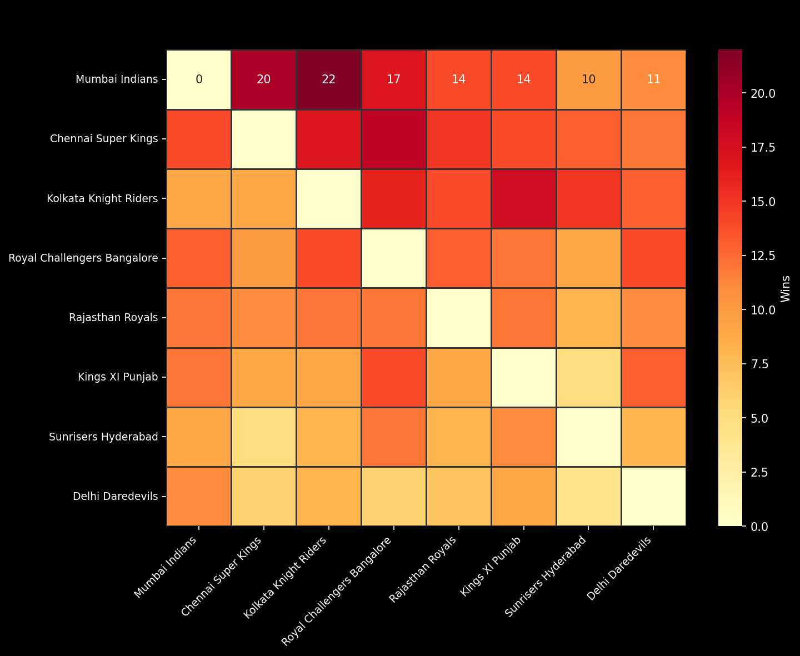

---

# 📈 Key Insights

- Mumbai Indians and Chennai Super Kings are among the most successful IPL teams.
- The number of matches has increased significantly across seasons.
- Winning the toss does not always guarantee winning the match.
- Some venues host a significantly larger number of matches than others.
- A few players dominate the Player of the Match awards.
- Teams' performances have evolved across IPL seasons.

---

# 💡 Skills Demonstrated

- Exploratory Data Analysis (EDA)
- Data Cleaning
- Statistical Analysis
- Data Visualization
- Python Programming
- Business Insight Generation
- Sports Analytics

---

# ⚙️ Installation

Clone the repository

```bash
git clone https://github.com/Ankit04raj/IPL-Data--Analysis--Dashboard.git
```

Move into the project directory

```bash
cd IPL-Data--Analysis--Dashboard
```

Install dependencies

```bash
pip install pandas numpy matplotlib plotly notebook
```

Launch Jupyter Notebook

```bash
jupyter notebook
```

Open

```
IPL.ipynb
```

Run all cells.

---

# 📌 Future Improvements

- Interactive Plotly Dashboard
- Streamlit Web App
- Power BI Dashboard
- Machine Learning Match Winner Prediction
- Player Performance Dashboard
- Live IPL Data Integration

---

# 🤝 Contributing

Contributions are welcome.

1. Fork this repository.
2. Create a feature branch.

```bash
git checkout -b feature-name
```

3. Commit your changes.

```bash
git commit -m "Added new feature"
```

4. Push your branch.

```bash
git push origin feature-name
```

5. Open a Pull Request.

---

# 📚 Dataset

The dataset contains historical IPL match records including:

- Match Date
- Season
- Teams
- Venue
- Toss Winner
- Match Winner
- Winning Margin
- Player of the Match

---

# 👨‍💻 Author

## Ankit Raj

**B.Tech Data Science Undergraduate**

### Connect with Me

- 🔗 GitHub: https://github.com/Ankit04raj
- 💼 LinkedIn: https://www.linkedin.com/in/ankit04raj/

---

# ⭐ Support

If you found this project useful,

⭐ Star this repository

🍴 Fork this repository

📢 Share it with others

---

# 📄 License

This project is licensed under the MIT License.

---

## 🚀 Thank You for Visiting!

*"Turning cricket data into actionable insights using Python and Data Analytics."*
